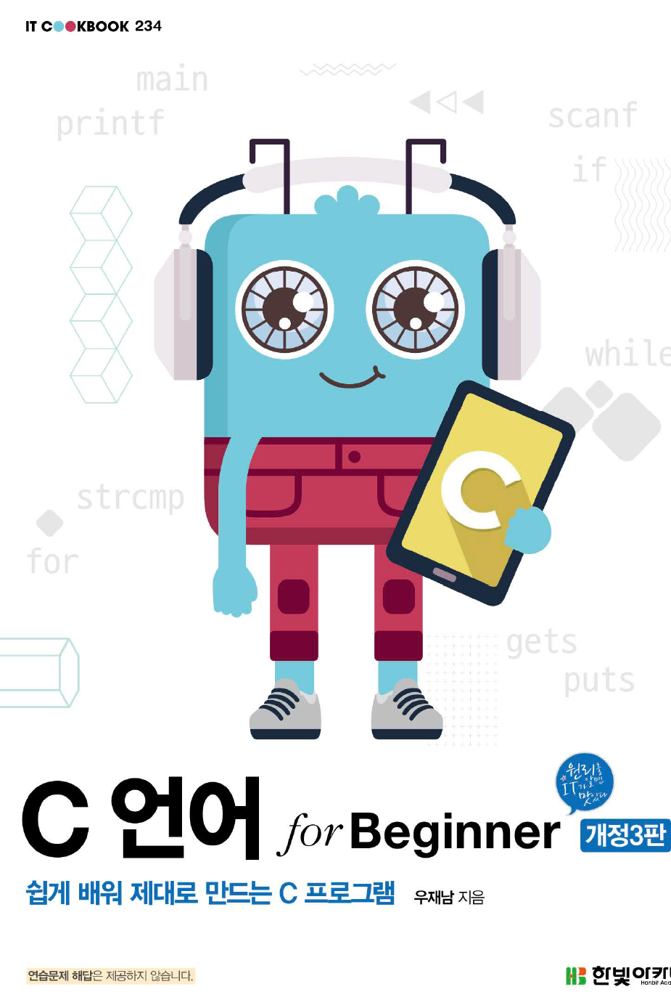

# C 언어

## 2021.12.19.

- #### 이 repo는  `c언어 for Beginner` 교재를 학습하며 작성한 예제소스를 보관하는 곳입니다.

- #### 깃허브 관련 교재를 공부한 후 공부한 내용을 올리니 외부에서 노트북으로 작업하기도 편하고 좋습니다.

- #### 아직 깃허브와 연동하는게 서툴러서 폴더 정리가 제대로 안 되는 느낌이지만 자꾸 하다보면 더 효율적으로 관리할 수 있을 것 같습니다.

> C언어 for Beginner 개정3판 -우재남, 한빛아카데미

